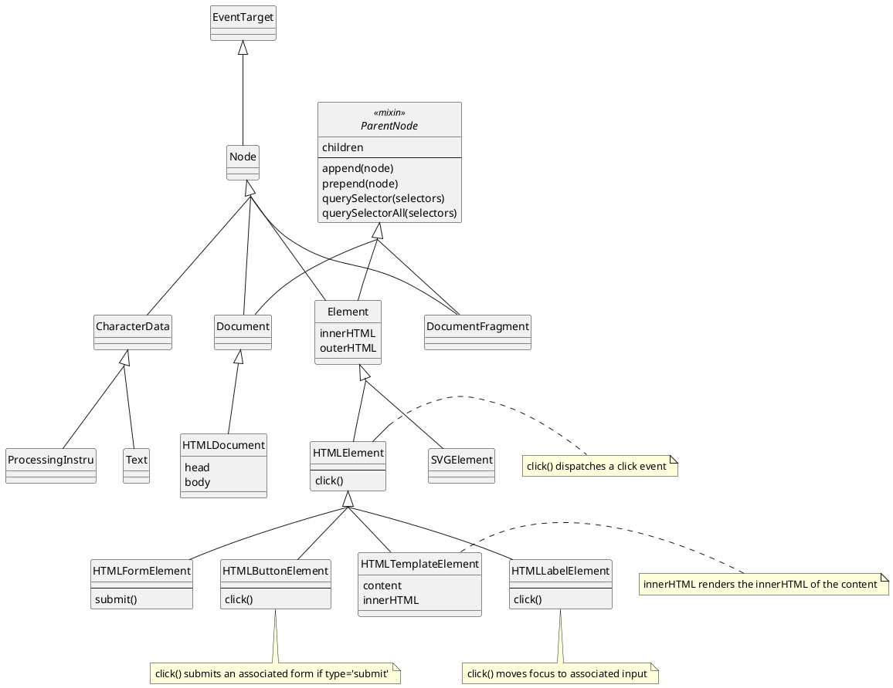

:: title ::

# The DOM - An API not suited for Go

:: left ::

- The core DOM and HTML DOM API represent a 1990s-style Object-Oriented API.
- Go doesn't support OOP in that sense.
- _Embedding_ can reuse behaviour.
- _Method overloading_ is not supported.

:: right ::

<v-drag pos="395,85,582,433">



</v-drag>

---
layout: top-title
color: slate
---

:: title ::

# Object-Oriented Model - Interfaces

:: content ::

<v-drag pos="63,139,486,212">

```go
package dom

type Node interface {
	event.EventTarget
	AppendChild(node Node) (Node, error)
	ChildNodes() NodeList
	CloneNode(deep bool) Node
	InsertBefore(newNode Node, referenceNode Node) (Node, error)
	OwnerDocument() Document
	ParentNode() Node
    // ...
}
```

</v-drag>

<v-drag pos="572,207,342,230">

```go
package dom

type Element interface {
    Node
	ClassList() DOMTokenList
	HasAttribute(name string) bool
	GetAttribute(name string) (string, bool)
	SetAttribute(name string, value string)
	RemoveAttribute(name string)
	GetAttributeNode(string) Attr
	SetAttributeNode(Attr) (Attr, error)
    // ...
}
```

</v-drag>

Interface `Element` includes all methods defined in interface `Node`

<StickyNote v-drag="[120,380,231,79]">

Go _interfaces_ resembles Object-Oriented inheritance

</StickyNote>

---
layout: top-title-two-cols
color: slate
---

<ArrowDraw color="red" v-drag="[602,277,156,51,-23]" v-click="3"/>
<div style="width:300px" v-drag="[364,322,300,53]" v-click="3">

This `node` knows nothing about being embedded in a `element`.

</div>

<StickyNote color="red" v-click="4" v-drag="[427,400,247,107]">

Cannot store the parent element as a `*Node`; it wouldn't be an `Element` anymore.

</StickyNote>

<StickyNote v-drag="[42,445,201,69]" v-click="5">

Go structs do **not** resemble Object-Oriented inheritance

</StickyNote>

:: title ::

# Object-Oriented Model - Structs

:: left ::

````md magic-move {lines: true, maxHeight:'20px'}
```go
type Node struct {
    event.EventTarget
    childNodes    []*Node
    parent        *Node
    ownerDocument *Document
}
```

```go
type Node struct {
    event.EventTarget
    childNodes    []*Node
    parent        *Node
    ownerDocument *Document
}

type Element struct {
    Node
    attributes []Attr
    tagName    string
}
```
````

:: right ::

<div class="struct" style="margin-bottom:1rem">
    <span>Node</span>
    <div class="field">
        <span>EventTarget</span>
        <div class="field">...</div>
    </div>
    <div class="field"><span class="name">childNodes</span> []*Node</div>
    <div class="field"><span class="name">parent</span> *Node</div>
    <div class="field"><span class="name">ownerDocument</span> *document</div>
</div>


<v-click at="2">
<v-drag pos="729,197,213,295">
<div class="struct">
    <span>Element</span>
    <div class="struct">
        <span>Node</span>
        <div class="field">
            <span>EventTarget</span>
            <div class="field">...</div>
        </div>
        <div class="field"><span class="name">childNodes</span> []*Node</div>
        <div class="field"><span class="name">parent</span> *Node</div>
        <div class="field"><span class="name">ownerDocument</span> *document</div>
    </div>
    <div class="field"><span class="name">tagName</span> string</div>
    <div class="field"><span class="name">attributes</span> []Attr</div>
</div>
</v-drag>
</v-click>

<style>
.struct {
width: max-content;
font-size: 0.8rem;
border: 1px solid black;
display: flex;
         flex-direction: column;
padding: 0.125rem 0.25rem;
         margin: 0.5rem 0;
         span {
             font-weight: bold;
         }
}

.field {
    border: 1px solid black;
    padding: 0.125rem 0.25rem;
    margin: 0.125rem 0;
    &:last-child {
        /* margin-bottom: 0; */
    }
}
</style>

---
layout: top-title
color: slate
---

<StickyNote v-drag="[687,106,180,88]">

`lowerCase` names are only accessible in the defining package.

</StickyNote>

:: title ::


# The Solution - Part 1

:: content ::

<StickyNote color="red" v-drag="[569,387,188,109]">

Same problem. `n *node` doesn't know if it was embedded in an `HTMLFormElement`

</StickyNote>

Use `struct`s for implementation, but only code against interfaces.

<v-drag pos="52,136,313,122">

```go
type Node interface {
	event.EventTarget
	AppendChild(node Node) (Node, error)

    setParent(node Node)
```

</v-drag>


<v-drag pos="485,157,363,199">

The implementation

```go
type node struct {
    event.EventTarget
    parentNode Node
    children   []Node
}

func NewNode() node { return &node{ /* ... */ }
```

</v-drag>

<v-drag pos="50,340,471,158">

## But

```go
func (n *node) AppendChild(child Node) (Node, error) {
    // return error if child is not a valid child of this node
    n.children = append(n.children, child)
    child.setParent(n)
}
```

</v-drag>

---
layout: top-title
color: slate
---

:: title ::

# The Solution - Part 2

:: content ::

Every `node` has `self` value. Every _specialized node_ **must** call `SetSelf`.

<v-drag pos="30,117,385,302">

```go
package dom

type Node interface {
    // ...
    SetSelf(Node)
}

type node struct {
    // ...
    self Node
}

func (n *node) SetSelf(self Node) {
    n.self = self
}

func (n *node) AppendChild(child Node) (Node, error) {
    // return error if child is not a valid child of this node
    n.children = append(n.children, child)
    child.setParent(n.self)
}
```

</v-drag>

<v-drag pos="442,124,522,410">

```go
package html

type HTMLFormElement interface {
	RequestSubmit(submitter dom.Element) error
}

type htmlElement struct {
    dom.Element
}

type htmlFormElement struct {
    htmlElement
}

func NewHTMLFormElement(ownerDocument HTMLDocument) HTMLFormElement {
    result = &htmlFormElement {
        NewHTMLElement(ownerDocument),
    }
    result.SetSelf(result)
    return result
}
```

</v-drag>

<StickyNote v-drag="[208,137,229,176]">

Not too happy, but it works

- Unidiomatic
- `SetSelf` is _exported_ (public)

A _strategy pattern_ could solve _some_ of the problems, but not all.

</StickyNote>
