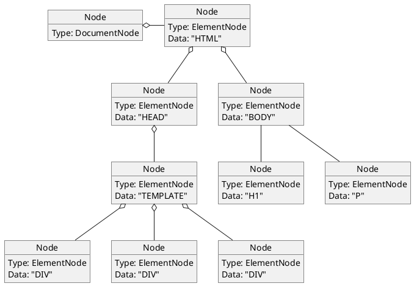
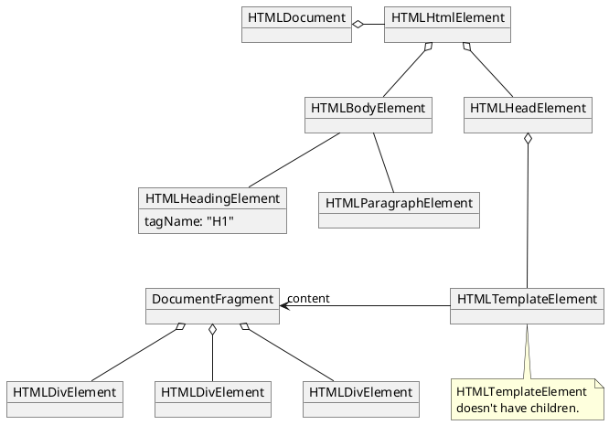

:: title ::

# Two-Step Parsing ##

:: content ::


<v-drag pos="24,82,334,86">

### The HTML

```html
<!doctype html><html><head><template>
    <div></div>
    <div></div>
    <div></div>
</template>
</head><body>
<h1>Heading</h1>
<p>Body</p>
</body></html>
```

</v-drag>

<ArrowDraw color="red" v-drag="[534,364,95,52,150]" />

<v-drag pos="553,67,424,307">

### `x/net/html` Representation




</v-drag>

<v-drag pos="339,165,72,44">

## DOM

</v-drag>

<v-drag pos="65,212,497,328">


<!-- note "HTMLTemplateElement" doesn't have any children" as n -->
<!-- HTMLTemplateElement .. n -->



</v-drag>
