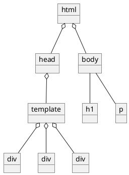
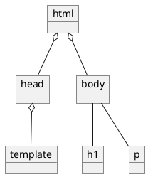
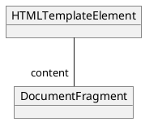

:: title ::

## Two-Step Parsing ##

:: left ::

## The HTML

<v-drag pos="62,126,334,86">
```html
<!doctype html><html><head>...</head><body>
...
</body></html>
```
</v-drag>

<ArrowDraw color="red" v-drag="[115,207,95,52,47]" />

<v-drag pos="96,162,270,346">

</v-drag>

:: right ::

## The DOM

<v-drag pos="434,142,222,249">

</v-drag>

<v-drag pos="698,320,198,153">

</v-drag>

---
src: ./building-object-oriented-model.md
---
